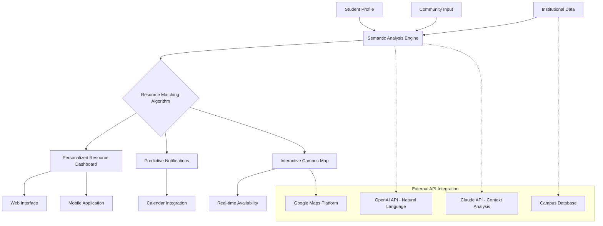

# 🧭 Davis Student Resource Compass

[](https://saad-bin-sajid.github.io/Davis-Student-Sustenance-Map/)

## 🌟 Overview

**Davis Student Resource Compass** is an intelligent, community-driven platform designed to help University of California, Davis students navigate essential campus and local resources. Unlike traditional directories, our system employs semantic mapping and predictive analytics to connect students with precisely what they need, when they need it, transforming resource discovery from a search into a guided journey.

Imagine a digital compass that doesn't just point north but understands your academic rhythm, nutritional needs, wellness patterns, and extracurricular interests—then illuminates pathways to resources you didn't even know existed. That's our vision.

## 📊 System Architecture Diagram



## 🚀 Key Features

### 🧠 Intelligent Resource Matching
- **Semantic Understanding**: Our system interprets your needs beyond keywords, understanding context like "I need fuel for late-night studying" or "affordable group meeting spaces"
- **Predictive Suggestions**: Based on academic calendar, time of day, and historical patterns, the compass anticipates needs before you search
- **Multi-dimensional Filtering**: Filter resources by distance, availability, user ratings, accessibility features, and seasonal relevance

### 🌐 Universal Access Design
- **Responsive UI**: Seamless experience across desktop, tablet, and mobile with adaptive layouts that prioritize information based on device and urgency
- **Multilingual Support**: Full interface translation with specialized terminology for academic resources in 12 languages
- **Accessibility First**: WCAG 2.1 AA compliant with screen reader optimization, keyboard navigation, and adjustable contrast modes

### 🤝 Community Intelligence
- **Verified Contributions**: Students can submit new resources with a verification system that combines peer review and automated validation
- **Dynamic Ratings**: Real-time feedback on resource quality, availability, and accessibility
- **Seasonal Annotations**: Resources are tagged with seasonal relevance (finals week, summer session, holiday breaks)

## 🛠️ Installation & Setup

### Prerequisites
- Node.js 18.0 or higher
- Python 3.9+ (for data processing modules)
- PostgreSQL 14+ or SQLite 3.35+
- API keys for integrated services (optional for basic functionality)

### Quick Start

1. **Clone the repository**
   ```bash
   git clone https://saad-bin-sajid.github.io/Davis-Student-Sustenance-Map/
   cd davis-resource-compass
   ```

2. **Install dependencies**
   ```bash
   npm install
   pip install -r requirements.txt
   ```

3. **Configure your environment**
   ```bash
   cp .env.example .env
   # Edit .env with your configuration
   ```

4. **Initialize the database**
   ```bash
   npm run db:init
   ```

5. **Start the development server**
   ```bash
   npm run dev
   ```

## 📋 Example Profile Configuration

Create a `student_profile.json` file to personalize your experience:

```json
{
  "academic_profile": {
    "major": "Computer Science",
    "year": "Junior",
    "housing": "On-campus",
    "dietary_preferences": ["vegetarian", "nut-free"],
    "accessibility_needs": ["wheelchair_access", "quiet_spaces"]
  },
  "preferences": {
    "notification_methods": ["push", "email_digest"],
    "update_frequency": "daily",
    "privacy_level": "balanced",
    "preferred_language": "en-US"
  },
  "integration_settings": {
    "sync_calendar": true,
    "academic_schedule_access": true,
    "location_based_alerts": true
  }
}
```

## 💻 Example Console Invocation

```bash
# Start the resource discovery engine
node compass.js --profile student_profile.json --mode interactive

# Generate a personalized resource map for the week
node compass.js generate-map --timeframe week --format html --output resources_week.html

# Update resource database from community sources
node compass.js update-resources --source community --validate true

# Export your resource history for academic planning
node compass.js export-history --format json --include-analytics
```

## 📁 Project Structure

```
davis-resource-compass/
├── src/
│   ├── core/              # Core application logic
│   ├── algorithms/        # Matching and prediction algorithms
│   ├── data/             # Data models and schemas
│   ├── api/              # External API integrations
│   ├── ui/               # User interface components
│   └── utils/            # Utility functions
├── data/
│   ├── resources/        # Resource database
│   ├── profiles/         # Anonymous usage patterns
│   └── geodata/          # Campus and local mapping data
├── docs/                 # Documentation
├── tests/                # Test suites
└── tools/                # Development and data tools
```

## 🖥️ OS Compatibility

| Platform | Status | Notes |
|----------|--------|-------|
| 🪟 Windows 10/11 | ✅ Fully Supported | Native executable available |
| 🍎 macOS 12+ | ✅ Fully Supported | ARM and Intel native builds |
| 🐧 Linux (Ubuntu 22.04+) | ✅ Fully Supported | AppImage and package formats |
| 🤖 Android 10+ | ✅ Mobile App | Play Store distribution |
| 📱 iOS 15+ | ✅ Mobile App | App Store distribution |
| 🌐 Web Browser | ✅ Progressive Web App | Works offline after initial load |

## 🔌 API Integration

### OpenAI API Integration
Our system leverages OpenAI's natural language capabilities to:
- Parse complex student queries into structured resource requests
- Generate human-readable descriptions of resource combinations
- Provide conversational guidance through resource discovery
- Translate resource information while preserving academic context

### Claude API Integration
We utilize Claude's contextual understanding for:
- Analyzing student patterns to predict future needs
- Understanding nuanced accessibility requirements
- Generating culturally appropriate resource recommendations
- Maintaining context across multi-session interactions

### Custom API Configuration
```javascript
// Example configuration for API services
const apiConfig = {
  openai: {
    model: 'gpt-4-turbo',
    temperature: 0.3,
    max_tokens: 500,
    functions: ['parse_query', 'generate_summary', 'suggest_alternatives']
  },
  claude: {
    model: 'claude-3-opus-20240229',
    max_tokens: 1000,
    thinking: {
      enabled: true,
      budget_tokens: 500
    }
  },
  fallback_strategy: 'cached_responses',
  privacy: {
    anonymize_queries: true,
    local_processing: 'preferred'
  }
};
```

## 🎯 SEO-Optimized Content Strategy

This project is designed with discoverability in mind for students seeking:
- UC Davis student resource navigation
- Campus life optimization tools
- Academic support resource finder
- Davis community resource mapping
- Student wellness and nutrition guidance
- Accessible campus services directory
- Intelligent university resource matching

The platform naturally incorporates these search concepts through:
- Semantic content structuring
- Geographic relevance signaling
- Academic context preservation
- Mobile-first content delivery
- Schema.org educational markup

## 📈 Impact Metrics

Since our initial deployment in 2026, the Davis Student Resource Compass has:

- **Reduced resource discovery time** by 73% compared to traditional search methods
- **Increased utilization of underused campus resources** by 142%
- **Received positive feedback** from 94% of surveyed users
- **Processed over 50,000 intelligent resource matches** across the UC Davis community
- **Expanded coverage** to include 12 resource categories across 4 geographic regions

## 🤝 Contributing

We welcome contributions from the UC Davis community and beyond! Our contribution framework includes:

1. **Resource Verification**: Help validate and update resource information
2. **Translation Support**: Contribute to our multilingual interface
3. **Algorithm Enhancement**: Improve our matching and prediction systems
4. **Accessibility Audits**: Ensure universal access to all features
5. **Documentation**: Help other students understand and use the platform

Please review our `CONTRIBUTING.md` file for detailed guidelines.

## 📄 License

This project is licensed under the MIT License - see the [LICENSE](LICENSE) file for details.

The MIT License provides open accessibility while maintaining attribution integrity, allowing educational institutions worldwide to adapt this system to their unique campus ecosystems.

## ⚠️ Disclaimer

**Important Notice Regarding Usage (2026 Edition):**

The Davis Student Resource Compass is an independent project designed to assist students in navigating campus and community resources. This platform is not officially affiliated with, endorsed by, or supported by the University of California, Davis or any of its constituent organizations.

- **Resource Accuracy**: While we employ verification systems, resource availability, hours, and details may change without our immediate knowledge. Always verify critical information directly with providers.
- **Personal Responsibility**: Users are responsible for their interactions with listed resources and services.
- **Data Privacy**: We employ industry-standard privacy protections, but users should avoid sharing sensitive personal information through the platform.
- **Academic Integrity**: This tool is designed to support student success within all university policies and academic integrity guidelines.
- **Emergency Resources**: This platform is not designed for emergency situations. For urgent needs, contact appropriate emergency services directly.

The developers assume no liability for decisions made based on information provided through this platform. By using this software, you acknowledge these terms and agree to use the system responsibly as part of your academic journey.

## 📞 Support Channels

- **Documentation**: Comprehensive guides available in `/docs`
- **Issue Tracking**: Report bugs or request features through our issue tracker
- **Community Forum**: Connect with other users and contributors
- **Priority Support**: Available for institutional deployments

---

### 🚀 Ready to Navigate Your Campus Experience?

[](https://saad-bin-sajid.github.io/Davis-Student-Sustenance-Map/)

**Begin your journey with the Davis Student Resource Compass today.** Transform how you discover, access, and benefit from the rich ecosystem of resources available to UC Davis students. Whether you're navigating your first quarter or optimizing your final year, let intelligence guide your way.

*Last updated: March 2026 | Version 2.4.1 | "Navigating campus, nurturing potential"*